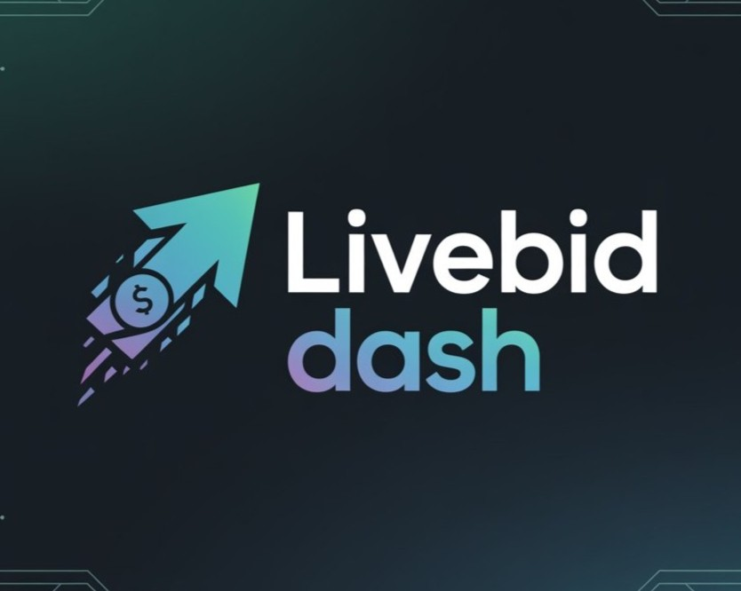

# Live Bid Dash 🏆

An advanced real-time auction platform built with React, TypeScript, and Supabase. Live Bid Dash provides a comprehensive solution for online auctions with real-time bidding, seller workflows, and administrative features.



## 🌟 Features

### Core Auction Features
- **Real-time Bidding**: Live bid updates using Supabase realtime subscriptions
- **Advanced Auction Management**: Create, schedule, and manage auctions with detailed configurations
- **Bid History & Analytics**: Comprehensive tracking of all bidding activity
- **Auto-extend Functionality**: Automatic auction extensions to prevent last-second sniping
- **Reserve Pricing**: Set minimum acceptable prices for auctions

### User Experience
- **Responsive Design**: Optimized for desktop, tablet, and mobile devices
- **Authentication**: Secure user registration and login with Supabase Auth
- **User Dashboards**: Personalized views for "My Auctions" and "My Bids"
- **Auction Watching**: Save and track interesting auctions
- **Search & Filtering**: Advanced search capabilities with category filtering

### Administrative Features
- **Seller Tools**: Comprehensive auction creation and management interface
- **Analytics Dashboard**: Real-time statistics and performance metrics
- **User Management**: Administrative controls and user oversight
- **Featured Auctions**: Highlight premium auctions on the homepage

## 🚀 Tech Stack

### Frontend
- **React 18** - Modern React with hooks and functional components
- **TypeScript** - Type-safe development
- **Vite** - Fast development and build tool
- **Tailwind CSS** - Utility-first CSS framework
- **Radix UI** - Accessible component primitives
- **Shadcn/ui** - Beautiful component library built on Radix
- **React Router v6** - Client-side routing
- **React Hook Form** - Form management with validation
- **Lucide React** - Beautiful icons

### Backend & Database
- **Supabase** - Backend-as-a-Service with PostgreSQL
- **Row Level Security (RLS)** - Database-level security
- **Real-time Subscriptions** - Live data updates
- **Authentication** - User management and auth flows

### Development & Deployment
- **ESLint** - Code linting and formatting
- **PostCSS** - CSS processing
- **Docker** - Containerized deployment
- **Render.com** - Cloud deployment platform
- **GitHub Actions** - CI/CD pipeline

## 📦 Installation

### Prerequisites
- Node.js 18+ 
- npm or yarn
- Git

### Local Development Setup

1. **Clone the repository**
   ```bash
   git clone https://github.com/a6uzar/Assignment_INE.git
   cd live-bid-dash
   ```

2. **Install dependencies**
   ```bash
   npm install
   ```

3. **Environment Configuration**
   Create a `.env.local` file in the root directory:
   ```env
   VITE_SUPABASE_URL=your_supabase_project_url
   VITE_SUPABASE_ANON_KEY=your_supabase_anon_key
   ```

4. **Start the development server**
   ```bash
   npm run dev
   ```

5. **Open your browser**
   Navigate to `http://localhost:8080`

## 🏗️ Project Structure

```
live-bid-dash/
├── public/                 # Static assets
│   ├── favicon.jpeg       # Application icon
│   └── robots.txt         # SEO configuration
├── src/
│   ├── components/        # Reusable UI components
│   │   ├── auction/       # Auction-specific components
│   │   ├── auth/          # Authentication components
│   │   ├── layout/        # Layout components
│   │   └── ui/            # Base UI components (shadcn/ui)
│   ├── hooks/             # Custom React hooks
│   ├── integrations/      # External service integrations
│   │   └── supabase/      # Supabase client and types
│   ├── lib/               # Utility functions
│   ├── pages/             # Page components
│   ├── utils/             # Helper utilities
│   └── main.tsx           # Application entry point
├── supabase/              # Supabase configuration
├── Dockerfile             # Docker container configuration
├── server.js              # Production server
└── package.json           # Dependencies and scripts
```

## 🔧 Available Scripts

- `npm run dev` - Start development server
- `npm run build` - Build for production
- `npm run build:dev` - Build for development
- `npm run preview` - Preview production build
- `npm run lint` - Run ESLint
- `npm start` - Start production server

## 🚀 Deployment

### Render.com Deployment

This project is configured for easy deployment on Render.com using Docker:

1. **Connect your GitHub repository** to Render.com
2. **Create a new Web Service** with these settings:
   - Build Command: `docker build -t live-bid-dash .`
   - Start Command: `docker run -p $PORT:3000 live-bid-dash`
   - Environment: Docker
3. **Set environment variables** in Render dashboard
4. **Deploy** - Automatic deployments on git push

### Docker Deployment

```bash
# Build the Docker image
docker build -t live-bid-dash .

# Run the container
docker run -p 3000:3000 live-bid-dash
```

## 🔒 Environment Variables

Required environment variables for deployment:

```env
VITE_SUPABASE_URL=your_supabase_project_url
VITE_SUPABASE_ANON_KEY=your_supabase_anon_key
PORT=3000  # For production deployment
```

## 🎯 Key Features Walkthrough

### 1. User Authentication
- Secure registration and login
- Password reset functionality
- Session management
- Protected routes

### 2. Auction Creation
- Rich text descriptions
- Multiple image uploads
- Scheduling options
- Category selection
- Pricing configuration

### 3. Real-time Bidding
- Live bid updates
- Bid history tracking
- Automatic bid validation
- Time remaining countdown

### 4. User Dashboard
- Personal auction management
- Bid tracking and history
- Watchlist functionality
- Performance analytics

## 🛠️ Development Guidelines

### Code Style
- TypeScript for type safety
- ESLint for code quality
- Component-based architecture
- Responsive design principles

### Database Schema
- Supabase PostgreSQL database
- Row Level Security (RLS) policies
- Foreign key relationships
- Real-time subscriptions

### Security Considerations
- Input validation and sanitization
- Authenticated API endpoints
- Secure file upload handling
- XSS and CSRF protection

## 🤝 Contributing

1. Fork the repository
2. Create a feature branch (`git checkout -b feature/amazing-feature`)
3. Commit your changes (`git commit -m 'Add amazing feature'`)
4. Push to the branch (`git push origin feature/amazing-feature`)
5. Open a Pull Request

## 📄 License

This project is licensed under the MIT License - see the [LICENSE](LICENSE) file for details.

## 📞 Support

For support and questions:
- Create an issue on GitHub
- Check the documentation
- Review existing issues and discussions

## 🙏 Acknowledgments

- [Supabase](https://supabase.com) - Backend infrastructure
- [Shadcn/ui](https://ui.shadcn.com) - Component library
- [Radix UI](https://radix-ui.com) - Accessible components
- [Tailwind CSS](https://tailwindcss.com) - Styling framework
- [Vite](https://vitejs.dev) - Build tool
- [React](https://reactjs.org) - Frontend framework

---

**Live Bid Dash** - Revolutionizing online auctions with real-time technology and modern user experience.
